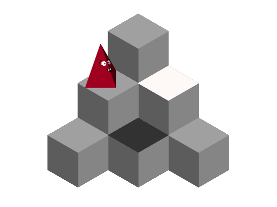

## Pointy - programming game

A LightBot inspired game. You're a pointy object on a grid and the objective is to press all the buttons. You do that by dragging and dropping commands (move, turn left, press button, jump etc.) into slots.

Each level has a different grid layout and a different number of buttons.

